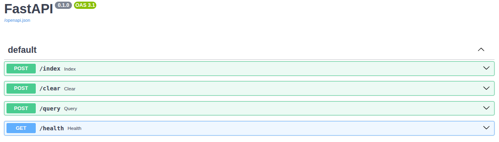

## LangChain RAG Project

### Overview

This project implements a **Retrieval-Augmented Generation (RAG)** system using **LangChain** and serves it through a **FastAPI** application running on **Uvicorn**. It allows you to query a vector store built from your documents with a modern, RESTful interface.  

The system is fully containerized with Docker for easy deployment. You can run the project with **Docker Compose** and interact with the RAG endpoints to index documents, query them, or manage your vector store.

---

### Quick Start

1. **Build and run the Docker container:**

```bash
sudo docker-compose up --build
```

2. **Access the API endpoints:**


| Endpoint | Method | Description |
|----------|--------|-----------|
| /index   | POST   | Index the documents in the vector store    |
| /clear   | POST   | Clear all documents from the collection    |
| /query   | POST   | Send a query to the RAG chain     |
| /health  | GET    | Check connectivity to the vector store    |

---
### Configuration

The project uses a config.yaml file located in the /app dictory to set default values for embeddings, document loading, vector store, and RAG parameters. 

Example:

```bash
embeddings:
  provider: "huggingface"          # "huggingface", "openai", "ollama"
  model_name: "sentence-transformers/all-mpnet-base-v2"
  dimension: 768

splitter:
  chunk_size: 1000
  chunk_overlap: 200
  add_start_index: true

loader:
  type: "pdf"                       # "pdf", "text", "csv"
  path: "./data/archive/Pdf/"
  glob: "*.pdf"

vectorstore:
  provider: "qdrant"                # "qdrant", "chroma"
  collection_name: "langchain_rag"
  distance_metric: "cosine"

rag:
  retriever_search_type: "similarity"  # "similarity", "mmr"
  retriever_k: 2
  llm_provider: "huggingface"
  llm_model: "openai/gpt-oss-120b"
  max_tokens: 2048
  provider_params:
    provider: "cerebras"
```

You can adjust the parameters to match your document type, embedding provider, or LLM preferences.

---
### Environment Variables

Create a .env file in the project root with the following content:

```bash
# Hugging Face
HUGGINGFACEHUB_API_TOKEN=

# Qdrant
QDRANT_API_KEY=
QDRANT_URL=

# Langsmith
LANGSMITH_API_KEY=
LANGSMITH_TRACING=

# Server
SERVER_HOST=   # e.g: 0.0.0.0
SERVER_PORT=   # e.g: 8000
```
These variables configure API keys for Hugging Face, Qdrant, Langsmith, and the server host/port.

---

### Accessing the FastAPI UI
Once the Docker container is running, you can access the **interactive FastAPI documentation and API explorer** in your web browser at:

http://127.0.0.1:\<PORT>/docs#/


- `<PORT>` corresponds to the value of `SERVER_PORT` in your `.env` file.  
- `127.0.0.1` (localhost) refers to your **local machine**.


